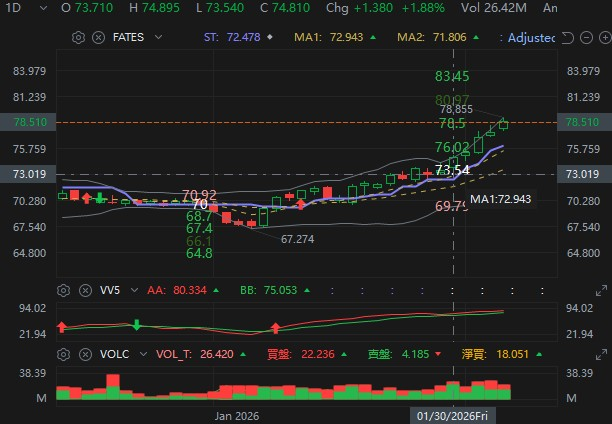

# 🥤 Coca-Cola (KO) 機構掃貨突破

**Date:** 2026-01-30
**Result:** +5.5% (持倉中)

## 🎯 交易邏輯 (The Logic)
昨日大市回調時，我發現防守板塊 (XLP) 異常抗跌。
Stock DNA 顯示 KO 的 **Momentum Z-Score** 突破了 2.0，且 Smart Money Flow 出現明顯的 Call 買入異動。

## ⚙️ 我的部署 (My Setup)
* **Entry Reason:** 突破 50 天線 + 2倍均量
* **Entry Price:** $73.8
* **Stop Loss:** $72.9 (跌破前日低點)
* **Take Profit:** 預期 $80 (Fate 日圖tp3)

> 💡 **學習點：** 當大市恐慌時，資金會流向防守股。這次交易不是賭運氣，是跟隨板塊輪動 (Sector Rotation)。